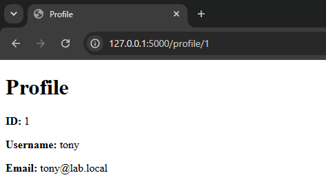
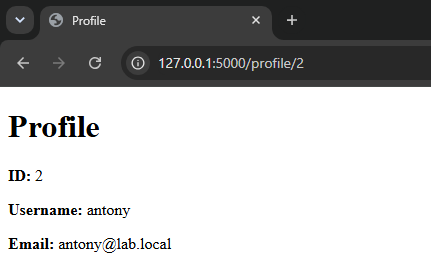
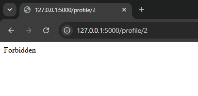

# A01 — Broken Access Control

## Overview

This laboratory demonstrates a **Broken Access Control** vulnerability through an **Insecure Direct Object Reference (IDOR)**.

The application contains two users, `tony` and `antony`. Each user should only be able to access their own profile.

The vulnerable application fails to properly validate whether the authenticated user is authorized to access the requested resource.

This laboratory contains two versions of the application:

* `vulnerable/` — intentionally vulnerable application
* `fixed/` — application with the vulnerability remediated

---

## Objective

The objectives of this laboratory are to:

* Understand the difference between authentication and authorization.
* Identify an access control vulnerability during a web application assessment.
* Test whether user-controlled identifiers can be manipulated.
* Exploit an IDOR vulnerability in a controlled environment.
* Document the impact of the vulnerability.
* Implement and validate a remediation.

---

## Environment

### Technologies

* Python
* Flask
* SQLite
* HTML
* Web Browser
* Burp Suite


### Application

The application provides a simple authentication system and user profiles.

```text
/login
/profile/<user_id>
```

The profile endpoint accepts a numeric user identifier.

---

## Lab Structure

```text
A01-Broken-Access-Control/
│
├── README.md
│
├── vulnerable/
│   ├── app.py
│   ├── database.py
│   ├── requirements.txt
│   └── templates/
│       ├── login.html
│       └── profile.html
│
├── fixed/
│   ├── app.py
│   ├── database.py
│   ├── requirements.txt
│   └── templates/
│       ├── login.html
│       └── profile.html
│
├── screenshots/
│
└── evidence/
```

---

## Test Credentials

The laboratory contains two intentionally created accounts.

| User  | Username | Password   | ID |
| ----- | -------- | ---------- | -- |
| tony | `tony`  | `tony123` | 1  |
| antony   | `antony`    | `antony123`   | 2  |

These credentials are for the isolated laboratory environment only.

---

# Vulnerable Application

## Installation

Navigate to the vulnerable application:

```bash
cd vulnerable
```

Install the dependencies:

```bash
pip install -r requirements.txt
```

Start the application:

```bash
python app.py
```

The application will be available at:

```text
http://127.0.0.1:5000
```

---

# Reconnaissance

After accessing the application, the login page was identified:

```text
GET /login
```

After authenticating as tony, the application redirects to:

```text
GET /profile/1
```

The following endpoint structure was identified:

```text
/profile/<user_id>
```

The `user_id` parameter represents the identifier of the requested profile.

This parameter is therefore a potential point of interest during access control testing.

---

# Authentication Testing

Authenticate using tony's credentials:

```text
Username: tony
Password: tony123
```

The application redirects to:

```text
/profile/1
```

The server returns tony's profile:

```text
ID: 1
Username: tony
Email: tony@lab.local
```

At this point, authentication is working as expected.

---

# Authorization Testing

The next step is to determine whether the application properly enforces authorization.

The original request is:

```http
GET /profile/1
```

Since tony is user `1`, this request is expected to succeed.

The identifier was then modified:

```http
GET /profile/2
```

The application returned:

```text
ID: 2
Username: antony
Email: antony@lab.local
```

The authenticated user was tony, but the application returned antony's profile.

---

# Vulnerability

The application verifies that the user is authenticated, but it does not verify whether the authenticated user is authorized to access the requested profile.

The vulnerable request flow is:

```text
tony authenticates
       │
       ▼
Session created
       │
       ▼
GET /profile/2
       │
       ▼
Server retrieves user #2
       │
       ▼
antony's information returned
```

The application trusts the `user_id` supplied in the URL without performing an authorization check.

---

# Root Cause

The vulnerable implementation retrieves the requested user directly:

```python
@app.route("/profile/<int:user_id>")
def profile(user_id):

    user = get_user(user_id)

    if not user:
        return "User not found", 404

    return render_template("profile.html", user=user)
```

There is no verification that:

```text
session["user_id"] == user_id
```

As a result, an authenticated user can request another user's profile by modifying the identifier.

---

# Exploitation with Burp Suite

The request can also be intercepted using Burp Suite.

Original request:

```http
GET /profile/1 HTTP/1.1
Host: 127.0.0.1:5000
Cookie: session=...
```

The identifier can be modified:

```http
GET /profile/2 HTTP/1.1
Host: 127.0.0.1:5000
Cookie: session=...
```

The server responds with:

```text
HTTP/1.1 200 OK
```

and returns antony's profile.

---

## Exploitation

The assessment was performed while authenticated as `tony`.

The legitimate request was:

GET /profile/1

The application returned Tony's profile.



The `user_id` parameter was then modified:

GET /profile/2

The application returned Antony's profile even though the
authenticated user was Tony.



---

### Evidence

Screenshots and HTTP request/response evidence are stored in:

```text
screenshots/
evidence/
```

---

# Impact

An attacker who is already authenticated may be able to access information belonging to other users by modifying resource identifiers.

In a real-world application, the impact could include unauthorized access to:

* Personal information
* Account information
* Documents
* Orders
* Messages
* Financial information
* Other user-controlled resources

The actual impact depends on what resources are protected by the vulnerable endpoint.

---

# Remediation

Authorization must be enforced on the server side for every protected resource.

The application should verify that the authenticated user has permission to access the requested profile.

For example:

```python
@app.route("/profile/<int:user_id>")
def profile(user_id):

    if "user_id" not in session:
        return "Unauthorized", 401

    if session["user_id"] != user_id:
        return "Forbidden", 403

    user = get_user(user_id)

    if not user:
        return "User not found", 404

    return render_template("profile.html", user=user)
```

The important difference is the authorization check:

```python
if session["user_id"] != user_id:
    return "Forbidden", 403
```

---

# Retesting


After implementing the authorization check, the same request
was tested again:

GET /profile/2

The server now returned:

HTTP 403 Forbidden




### Authorized request

```http
GET /profile/1
```

Expected result:

```text
HTTP 200 OK
```

tony can access her own profile.

### Unauthorized request

```http
GET /profile/2
```

Expected result:

```text
HTTP 403 Forbidden
```

tony can no longer access antony's profile.

---

# Authentication vs Authorization

This laboratory demonstrates an important distinction:

```text
Authentication
      │
      ▼
"Who are you?"
      │
      ▼
tony
```

and:

```text
Authorization
      │
      ▼
"What are you allowed to access?"
      │
      ▼
tony → /profile/1
tony → /profile/2 ❌
```

Being authenticated does not automatically mean that a user is authorized to access every resource.

---

# Methodology

The assessment followed the following methodology:

```text
1. Reconnaissance
        ↓
2. Endpoint identification
        ↓
3. Parameter identification
        ↓
4. Authentication
        ↓
5. Authorization testing
        ↓
6. Controlled exploitation
        ↓
7. Evidence collection
        ↓
8. Impact assessment
        ↓
9. Remediation
        ↓
10. Retesting
```

---

# Tools Used

* Python
* Flask
* SQLite
* Burp Suite
* Web Browser

---

# Key Takeaways

This laboratory demonstrates that access control must be enforced server-side and should not rely on user-controlled identifiers.

The main lesson is:

> **Authentication determines who the user is. Authorization determines what the user is allowed to do.**

An application can have correctly implemented authentication while still being vulnerable to Broken Access Control.

---

# References

* [OWASP Web Security Testing Guide](https://owasp.org/www-project-web-security-testing-guide/)
* [OWASP API Security — Broken Object Level Authorization](https://owasp.org/API-Security/)
